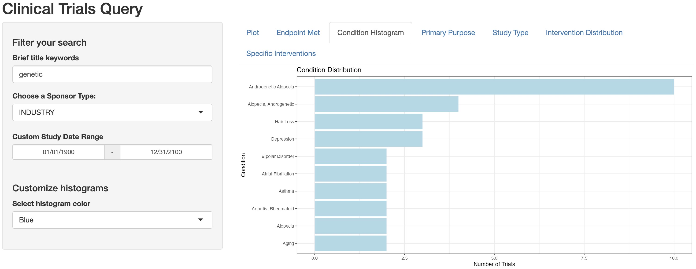
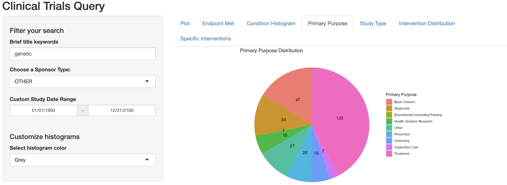
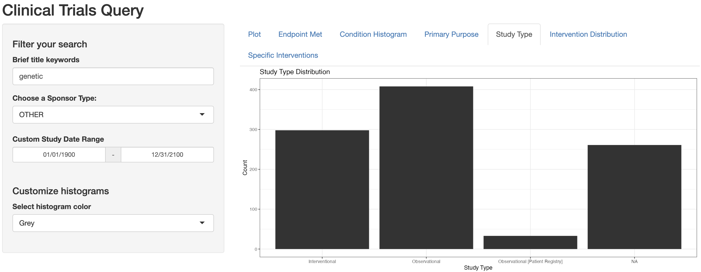

# Clinical Trials Query

This web application allows users to query clinical trial studies,
interact with the filtered data table, and visualize and customize
graphs according to needs. To learn more information about the clinical
trials, go to the website
[ClinicalTrials.gov](https://clinicaltrials.gov).

In this `README.md` file, we will explain the numerous features of the
application, as well as provide you with the motivations behind these
implementations.

## 1. App Features: Filtering Studies

The first class of features in this app is a set of input widgets that
take input from users and query the study entries accordingly.

The database includes information of 467212 different clinical studies.
Therefore, these widgets work as a powerful tool to allow users explore
the data and quickly search through the studies in the database.
Specifically, each filter helps users restrict their search results by a
different aspect.

#### **1.1 Title Keyword Search**

Each clinical study has a brief description (stored in the “brief_title”
column). We add a widget to the UI:
`textInput("brief_title_kw", "Enter title keywords")` to allow users
search for one or multiple keywords separated by commas.

Calling the function `query_kwds(studies, kwds, "brief_title")`, which
is defined in the `ct-util.R` file, will transform the keyword(s) into a
SQL-style query to filter entries in the “studies” data table whose
values in the “brief_title” column match with the keyword(s). The
utility of this function can be generalized beyond this application to
other databases.

An example search is shown below:

**Enter title keywords:**  Treatment, NSCLC

``` r
query_kwds(studies, c("Treatment", "NSCLC"), "brief_title", match_all = T) |> 
  select(nct_id, brief_title) |>
  head(5)
```

    ## # Source:   SQL [5 x 2]
    ## # Database: DuckDB 0.8.1 [root@Darwin 21.6.0:R 4.2.2/../ctrialsgovdb/ctrialsgov.duckdb]
    ##   nct_id      brief_title                                                       
    ##   <chr>       <chr>                                                             
    ## 1 NCT00824746 Study of Gefitinib Retreatment in Non-Small Cell Lung Cancer (NSC…
    ## 2 NCT01951157 A Clinical Study in Three-arm of Lurbinectedin (PM01183) Alone or…
    ## 3 NCT03520686 QUILT 2.023: A Study of N-803 in Combination With Current Standar…
    ## 4 NCT03916627 Neoadjuvant Cemiplimab for the Treatment of Resectable NSCLC, HCC…
    ## 5 NCT04820023 Phase 1/2 Study of BBT-176 in Advanced NSCLC With Progression Aft…

#### **1.2 Define Study Date Range**

The start and completion date of each clinical study is recorded in the
“start_date”and “completion_date” columns of the studies data table.
Because the database we use for this application encompasses studies
across a wide range of time period, we want to add a widget to allow
users filter the search results based on study dates, as shown bellow:

``` r
dateRangeInput("date_range", "Custom Study Date Range",
                     start = "1900-01-01",
                     end = "2100-12-31",
                     format = "mm/dd/yyyy",
                     separator = " - ")
```

Users can select both the **start** and the **end** date, and the
`data_query_search()` function in the `ct-util.R` file will filter
studies that fall within this given time range. This is not only useful
for looking up studies carried out at a specific time, but also helpful
for filtering out ongoing studies or spotting studies whose dates are
not well-documented (i.e., abnormal dates).

#### **1.3 Define Sponsor Type** 


Users can select a specific sponsor type. The data is filtered by this 
chosen sponsor type and by keywords and date range using the 
`data_query_search()` function in the `ct-util.R` file. Users can choose 
from the list as shown in the code chunk below (the default choice is OTHER):

``` r
selectInput("sponsortype", "Choose a Sponsor Type:",
choices = c("OTHER", "AMBIG", "FED", "INDIV", "INDUSTRY", "NETWORK", "NIH", "OTHER_GOV", "UNKNOWN")),
```

Filtering by
different sponsor types allow uses to examine the differences in studies 
that have different sponsor types. These differences might link to study 
outcomes and can potentially be helpful in future decisions regarding sponsor 
choices and spotting potentially beneficial sponsor opportunities.

#### **1.4 Output: Interactive Data table**

The query results are organized into an interactive data table and
displayed on the right-hand-side panel with the `DT::renderDataTable()`
function call. The default columns displayed are
`nct_id, brief_title, phase, start_date, and completion_date`. The table
is interactive in that users can customize the number of rows displayed
on a page, go back and forther the pages, and further narrow the results
using the `"Search"` tab on top of the table.

## 2. App Features: Displaying Visualizations

Aside from the data table showing all the query results, we want to
include additional visualizations to help users explore and learn about
the distributions of the data.

#### 2.1 Phase Histogram

The first graph is a histogram showing the number of each study phase,
including missing values (“NA”) and “not applicable”. An example plot is
shown bellow:

<!-- -->

#### 2.2 Condition Histogram [This feature answers question 2]

A new tab that gives a histogram showing most frequent 10 conditions that trials in a query are examining. The condition could be filtered by other features from `section 1`, including study date range, sponsor type, and a user defined color of histogram. The useful information provided by the histogram includes the frequency of trials per condition, trends over time, and the emphasis placed on certain conditions by various sponsor types. An example plot is shown bellow: 

<!-- -->

#### 2.3 Primary Purpose Pie Chart
Users can also view the distribution of different primary purposes among the filtered studies. Understanding the primary purpose of different studies helps identify the focus of research efforts, such as treatment, prevention, and so on. It shows the main directions of current research within specific health domains. Additionally, this is also helpful in making healthcare-related decisions such as resource allocation. An example plot is shown bellow: 




#### 2.4 Study Type Histogram
Users can view the distribution of different study types among the filtered studies. It is important to visualize results by study type, because it can showcase different study types within a specific date range. In addition, it can also show the main types of studies being conducted regarding certain health issues or domain. This helps to inform about possible existing research gaps and potential innovative research methods. An example plot is shown bellow: 

<!-- -->

#### 2.5 Intervention Type Pie Chart

Users can view the distribution of different intervention types among the filtered studies. The pie chart conveys the proportional representation of various intervention types in the database of clinical trials. This information can be leveraged to identify trends in medical research, recognize potential areas of market saturation or underrepresentation, and make informed decisions about future research directions or investments. For example, a large proportion of  in "Diagnostic Test" interventions might indicate a growing market for diagnostic tools, whereas a small proportion in "Behavioral" interventions could reveal a potential area for exploration or opportunity for innovation in treatment approaches. An example plot is shown bellow: 

<!-- -->

#### 2.6 Intervention Histogram Specified by Intervention Type
Users can view the top 10 interventions specified by an intervention type, as well as other filtering conditions listed in `section 1` (study date, sponsor type, brief title keyword, color of histogram). Users can select a specific intervention type using the drop-down list as shown in the code chunk below (the default choice is OTHER):

``` r
selectInput("intervention_type", "Choose an intervention type:",
                               choices = c("Other",
                                           "Combination Product",
                                           "Behavioral",
                                           "Dietary Supplement",
                                           "Diagnostic Test",
                                           "Drug",
                                           "Device",
                                           "Procedure",
                                           "Genetic",
                                           "Biological",
                                           "Radiation")), 
```

The feature offers significant benefits to researchers and healthcare practitioners. Suppose they are interested in understanding the most prevalent drug interventions for `breast cancer`; they can simply enter `breast cancer` into the brief title keyword field and select 'Drug' as the intervention type. Paired with the pie chart functionality, this tool not only reveals the most common types of interventions but also highlights the specific interventions that are most frequent within each category. This dual-layered insight is extremely beneficial for research objectives and can further contribute to patient care advancements.

An example plot is shown bellow: 

<!-- -->

#### 2.7 Graph Aesthetics

Users can also customize the color for the graphs from a set of choices
including `Grey, Blue, Green, Red, and Purple`. The default is `Grey`.

``` r
selectInput("color", "Select histogram color", 
                  choices = c("Grey" = "grey20","Blue" = "lightblue",
                              "Green" = "lightgreen","Red" = "salmon", 
                              "Purple" = "purple"),
                  selected = "grey20")
```
